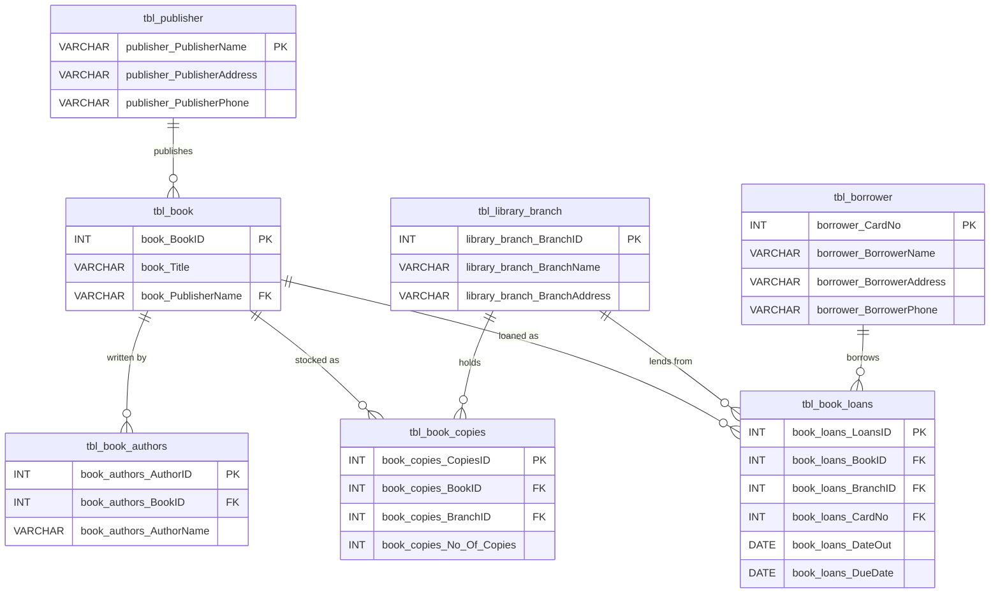

# Library Management System (SQL)

A relational database project that models the core operations of a multi-branch library: publishers, books, authors, branches, inventory, borrowers, and loans. The script creates the schema, loads sample data, and answers seven business questions with SQL queries.


---

## Table of Contents

1. [Overview](#overview)
2. [Features](#features)
3. [Database Schema](#database-schema)
4. [Getting Started](#getting-started)
5. [Sample Data](#sample-data)
6. [Business Queries](#business-queries)
7. [Design Notes](#design-notes)
8. [Known Limitations](#known-limitations)
9. [Future Improvements](#future-improvements)

---

## Overview

| Item | Detail |
|------|--------|
| **Database name** | `LibraryDB` |
| **DBMS** | MySQL 8.0+ (MariaDB compatible) |
| **File** | `Library_Management.sql` |
| **Tables** | 7 |
| **Purpose** | Practice schema design, referential integrity, joins, aggregation, and subqueries |

The single script is fully re-runnable: it drops existing tables before recreating them, so you always start from a clean state.

## Features

- Normalized schema with primary keys, foreign keys, and cascading updates/deletes
- Auto-incrementing IDs for branches, authors, copies, and loans
- Realistic seed data: 16 publishers, 20 books, 4 branches, 8 borrowers, 11 loans
- Inventory generated with a `CROSS JOIN` (every book stocked at every branch)
- Seven analytical queries covering joins, `LEFT JOIN`, `GROUP BY`, `HAVING`, and subqueries

## Database Schema

### Entity Relationship Diagram



### Table Summary

| Table | Description | Key |
|-------|-------------|-----|
| `tbl_publisher` | Publisher name, address, phone | PK: `publisher_PublisherName` |
| `tbl_library_branch` | Library branches and locations | PK: `library_branch_BranchID` (auto) |
| `tbl_book` | Book catalog, linked to a publisher | PK: `book_BookID`; FK → publisher |
| `tbl_book_authors` | Book-to-author mapping (supports multiple authors) | PK: `book_authors_AuthorID` (auto); FK → book |
| `tbl_borrower` | Registered library patrons | PK: `borrower_CardNo` |
| `tbl_book_copies` | Number of copies of each book at each branch | PK: `book_copies_CopiesID` (auto); FK → book, branch |
| `tbl_book_loans` | Checkout records with out/due dates | PK: `book_loans_LoansID` (auto); FK → book, branch, borrower |

All foreign keys use `ON UPDATE CASCADE ON DELETE CASCADE`.

## Getting Started

### Prerequisites

- MySQL 8.0+ or MariaDB 10.4+
- A client such as MySQL CLI, MySQL Workbench, DBeaver, or DataGrip

### Installation

Clone the repository first:

```bash
git clone https://github.com/Palavalasamounika13/Library_Management.SQL.git
cd Library_Management.SQL
```

**Option 1: Command line**

```bash
mysql -u <username> -p < Library_Management.sql
```

**Option 2: Inside the MySQL shell**

```sql
SOURCE /path/to/Library_Management.sql;
```

**Option 3: GUI client**

Open `Library_Management.sql` in MySQL Workbench (or similar) and execute the whole script.

### Verify the setup

```sql
USE LibraryDB;
SHOW TABLES;
SELECT COUNT(*) FROM tbl_book;   -- expected: 20
```

> **Warning:** The script runs `DROP TABLE IF EXISTS` on all seven tables. Do not run it against a database that contains data you want to keep.

## Sample Data

| Entity | Rows | Notes |
|--------|------|-------|
| Publishers | 16 | Includes Bloomsbury, Viking, Scholastic, Bantam, etc. |
| Library branches | 4 | Sharpstown, Central, Saline, Ann Arbor |
| Books | 20 | Fantasy, sci-fi, horror, and classics |
| Authors | 20 | One book (*Eragon*) has two authors |
| Borrowers | 8 | Card numbers 100 to 107 |
| Book copies | 80 | 5 copies of each book at each of the 4 branches |
| Loans | 11 | Dates in early 2018 |

## Business Queries

The script ends with seven queries. Expected results with the included sample data are shown below.

| # | Question | Technique | Expected result |
|---|----------|-----------|-----------------|
| 1 | Copies of *The Lost Tribe* at **Sharpstown** | Multi-table `JOIN` | `5` |
| 2 | Copies of *The Lost Tribe* at **each branch** | Multi-table `JOIN` | 5 copies at each of the 4 branches |
| 3 | Borrowers with **no books checked out** | `NOT IN` subquery | Jane Smith, Angela Thompson, Harry Emnace, Haley Jackson, Michael Horford |
| 4 | Sharpstown loans **due 2018-02-03**: title, borrower name, address | `JOIN` + filters | 6 rows, all borrowed by Tom Li |
| 5 | **Total loans per branch** | `LEFT JOIN` + `GROUP BY` | Sharpstown 10, Central 1, Saline 0, Ann Arbor 0 |
| 6 | Borrowers with **more than 5** books checked out | `GROUP BY` + `HAVING` | Tom Li (6 books) |
| 7 | Stephen King books and copies at **Central** | `JOIN` + filters | *It* (5), *The Green Mile* (5) |

### Example: Query 5

```sql
SELECT lb.library_branch_BranchName, COUNT(bl.book_loans_LoansID) AS Total_Loans
FROM tbl_library_branch lb
LEFT JOIN tbl_book_loans bl ON lb.library_branch_BranchID = bl.book_loans_BranchID
GROUP BY lb.library_branch_BranchName;
```

A `LEFT JOIN` is used so branches with zero loans still appear in the result.

## Design Notes

- **Naming convention:** Columns are prefixed with their table name (e.g. `book_Title`) to avoid ambiguity in joins.
- **Many-to-many authorship:** Authors are stored in a separate table so a book can have multiple authors and an author can have multiple books.
- **Inventory model:** `tbl_book_copies` stores one row per book-per-branch, which keeps stock counts separate from the catalog.
- **Referential integrity:** Cascading rules keep related records consistent when a parent record is changed or removed.
- **Query 3 style:** `NOT IN` works here because `book_loans_CardNo` contains no `NULL` values. If `NULL` values were possible, `NOT EXISTS` would be the safer choice.

## Known Limitations

- `tbl_publisher` uses the publisher name as its primary key, so renaming a publisher cascades across `tbl_book`.
- *A Wise Mans Fear* (Book ID 7) has no author record in the seed data.
- Some publisher phone numbers (e.g. `-8466`, `-12006`) and "Not Available" values are placeholders, not valid data.
- Phone numbers are stored as `VARCHAR`, with no format validation.
- No `NOT NULL`, `UNIQUE`, or `CHECK` constraints are defined beyond primary and foreign keys.
- Loans have no return date, so returned and outstanding books cannot be distinguished.
- Loan checks do not verify that copies are available at the branch.

## Future Improvements

- Add `NOT NULL`, `UNIQUE (book_BookID, branch_ID)`, and `CHECK (No_Of_Copies >= 0)` constraints
- Add a `DateReturned` column and late-fee logic
- Replace the publisher name key with a surrogate `PublisherID`
- Add indexes on frequently joined foreign key columns
- Create views for common reports (overdue loans, branch inventory)
- Add stored procedures for checkout and return workflows with availability checks
- Add triggers to update `No_Of_Copies` automatically on checkout and return

## License

This project is provided for educational purposes. Add a license of your choice (e.g. MIT) before publishing.

## Author

**Palavalasa Mounika**

- GitHub: [Palavalasamounika13](https://github.com/Palavalasamounika13)
- LinkedIn: [Palavalasa Mounika](https://www.linkedin.com/in/palavalasa-mounika-4501a8255/)
- Repository: [Library_Management.SQL](https://github.com/Palavalasamounika13/Library_Management.SQL)
